# DBMS ORU KILO
Finally ready to study the the basics of DBMS now. I was not able to wrap my head around the existence of DBs and the details supporting it in clg. Its nice to say that now after 4 yrs , I am acknowledging its presence.


So the book I am going through is Database system concepts (7th edition) by 
 Abraham Silberschatz
 Henry F. Korth
 S. Sudarshan

I am eager to find out whether this journey will make me solve these puzzles
- What is inside a DB and how is it driving basically?
- SQL vs NOSQL . what is the difference under the hood
- How does indexes work
- Sharding ? dont even know the spelling
- How is concurreny issues are handled
- How DBs can revert to previous state.  version control ?. idk.


>  Abstraction allows a person to use a complex device or system without having to know the details of how that device or system is constructed. I am a curiois person. I cannot talk abstraction. What do you mean?
> For example, A person is able to drive a car by knowing how to operate its controls. However, the driver does not need to know how the motor was built nor how it operates. Allthe driver needs to know is an abstraction of what the motor does.
>  Key to the management of complexity is the concept of abstraction.

##  DBMS Intro
*  A database-management system (DBMS) is a collection of interrelated data and a set of programs to access those data.

* The collection of data is called the database.

* Database system provides a simpler, abstract view of the information so that users and application programmers do not need to be aware of the underlying details of how data are stored and organized.

* By assuming that the DBMS doesn't exists and the datas are written and read from the OS files directly.We will face issues:
    1. Data redundancy and inconsistency
    2. Difficulty in acccessing data
    3. Data integrity is questionable and cannot enforce constraints on data
    4. Atomicity problem - funds transfer must be atomic—it must happen in its entirety or not at all.It is difficult to ensure atomicity in a conventional file-processing system.
    5. Concurrent access anamolies
    6. Security problems
* We shall see the concepts and algorithms that enable database systems to solve the problems with file-processing systems

* Major purpose of the database is to give users with an abstract view of the data.
### Data Models
* <b> Underlying the structure of a database is the data model:
    a collection of conceptual tools for describing data, data relationships, data semantics, and consistency constraints. </b>
* Data models are classified into 4 categories.
    1. #### Relational Model
        - The relational model uses a collection of tables to represent the data and  relationship among those data.
        - <b>Its conceptual simplicity compared to earlier data models such as the network model or the hierarchical model has led to its widespread adoption. </b>
    2. #### Entity-Relationship Model
        The E-R model uses a collection of objects, called entities and relationship among these objects. The E-R model is widely used for designing a database.
    3. #### Semi-structured data Model
        The semi-structured data model permits the specification of data where the individual data items of a particular type may have different set of attributes. This contrast to what we see in the previous models where every items of a particular type must have the same set of attributes. XML and JSON are the widely used semi-structured data representations.
    4. #### Object-Based data Model
        the concept of objects is well integrated into relational databases.
        This was developed to give way for the object-oriented programming arrival.

#### Data Abstraction
* Three levels of abstraction was formed to simplify users interactions with the system.
    1. #### Physical Level
        - Lowest level of abstraction
        - Describes how the data are actually stored
    2. #### Logical Level
        - Describes what data are stored in DB and what relationship exist among those data.
        - Database adminstrators who decide what info to keep in the DB use the logical level of abstraction.
        - Logical level supplements the physical data independence.
    3. #### View level
        - Highest level of abstraction
        - Describes only part of the entire database.
        - Simplies the users interaction with the database by creating views with only the necessary data (part of the database).

The database system allows application developers to store and retrieve data using the abstractions of the data model, and converts the abstract operations into operations on the low-level implementation.

* Databases use a type of data structure called an <i>index</i> to support efficient retrieval of records; these too form part of the physical level.

#### Instance
The collection of information stored in the database at a particular moment is called an instance of the database.

#### Schema
* <b>The overall design of the database is called the database schema. </b>

* The physical schema describes the database design at the physical level, while the logical schema describes the database design at the logical level. A database may also have several schemas at the view level, sometimes called subschemas,thatdescribe different views of the database.

*  Application programs are said to exhibit physical data independence if they do not depend on the physical schema and thus need not be rewritten if the physical schema changes, since programmers construct applications using logical schema.

### Database Languages
* Database provides 
 - Data Definition Language (DDL) to specify the database schema.
 - Data Manipulation Language (DML) to express database queries and updates.

    1. #### DDL
        provides facilities to specify consistent constraints on the data stored. The database system checks these constraints everytime the database is updated.
        ##### Domain Constraints
            - Must declare a domain of possible values with every attribute like integer/character/data,time types.
            - Domain constraints are the most elementary form of integrity constraint.
        ##### Referential Integrity
            -  There are cases where we wish to ensure that a value that appears in one relation for a given set of attributes also appears in a certain set of attributes in another relation (referential integrity). 
            -  When a referential-integrity constraint is violated, the normal procedure is to reject the action that caused the violation
        ##### Authorization
            - Differentiating users by the type of access permitted on certain data values in the database is expressed in terms of authorization.read authorization, insert authorization, delete authorization , updated authorization or a combination of these.
        DDL statments are processed similarly like any other programming language. DDL output is placed  in the <b><i>data dictionary</i></b>, which contains <b><i>metadata</i> - that is data about data</b>
        Data dictionary is a special type of table that can be accessed and updated only the database system itself and not by a regular user.
        Database system consults the data dictionary before reading or modifying the data.

    #### SQL DDL
     SQL provides a rich DDL that allows one to define tables with data types and integrity constraints.
    ```
        CREATE TABLE department (
            dept_name CHAR(20),
            building CHAR(15),
            budget NUMERIC(12,2)
        );
    ```

    2. #### DML
        It is language that enables users to access or manipulate the data as organised by the appropriate data model.
        - retrieval
        - insertion
        - deleteion
        - modification
        DML has two types of data manipulation languages
        ###### Procedural DMLs
            requires users to specify what data are needed and how to get those data.
        ###### Declarative DMLs or (non-procedural DMLs)
            requires users to specify what data are needed without having to specify how to get those data.
         A <b><i>query</i></b> is a statement requesting the retrieval of information.
        The level of abstraction also applies to manipulating the data.
        The query processor component takes care of translating the DML queries into sequence of actions at the physical level of database.
    
    #### SQL DML
     The SQL query language is nonprocedural. A query takes as input several tables (possibly only one) and always returns a single table.
     ```
            SELECT instructor.name
            FROM instructor
            WHERE instructor.dept name = 'History';

            SELECT instructor.ID, department.dept name
            FROM instructor, department
            WHERE instructor.dept name= department.dept name and
                  department.budget > 95000
     ```
    
    Databases are accessed by the application programs using a set of procedures or application program interface , which can allow programs to send DDL and DML statements to the database and retrieve the results.
    - Open Database Connectivity (ODBC) standard defines APIs used with C.
    - Java Database Connectivity (JDBC) standard defines APIs used with Java.

### Database Design
1. #### Conceptual design 
    - Gathering the data needs and requirement from users which helps to develop the Entity Relationship Model
    - The conceptual schema specifies the entities that are represented in the database, the attributes of the entities, the relationships among the entities, and constraints on the entities and relationships.
    - Fully developed conceptual schema indicates the functional requirements of the enterprise.
    - By the collecting the specification of functional requirements (transactions aka the operations that will be performed on data) from the users helps to review the developed schema.

The process of moving from an abstract data model to the implementation of the database proceeds in two final design phases.

2. #### Logical design phase
    The designer maps the high-level conceptual schema onto the implementation data model of the database system that will be used. the typically used data model is relational model.so the Entyty relationship model will be mapped into relational schema in this phase.
3. #### Physical design phase
    The designer uses the resulting system-specific database schema in the subsequent physical-design phase,in which the physical features of the database are specified. These features include the form of file organization and the internal storage structures.

Avoiding <b>redundancy</b>  and <b>incompleteness</b> helps in the design process.

 ### Entity-Relationship Model
  The entity-relationship (E-R) data model was developed to facilitate database design by allowing specification of an enterprise schema that represents the overall logical structure of a database.
  The E-R data model employs three basic concepts: entity sets, relationship sets, and attributes
  #### Entity Sets
  An <b>entity</b> is a “thing” or “object” in the real world that is distinguishable from all other objects.
  An <b>entity set</b> is a set of entities of the same type that share the same properties, or attributes. 
  #### Attributes
  Attributes are descriptive properties possessed by each member of an entity set. 
  #### Relationship Sets
  A <b>relationship</b> is an association among several entities.
  A <b>relationship set</b> is a set of relationships of the same type.

  - In this example, the instructor and student are the entities and the attributes are ID,name,salary etc.
  The relationship set is advisor represented by diamond shape with lines connecting to the entities.
  Primary keys ID is underlined in the entity diagram.
  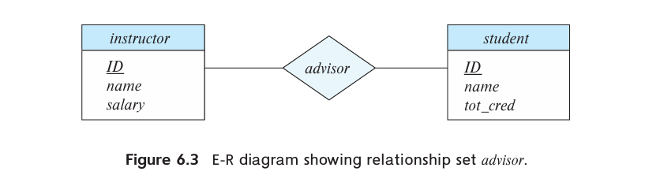
  

  * <b>Recursive relationship example</b>
  course relation and the prerequisite of another course is reperesented by the ER diagram as below:
  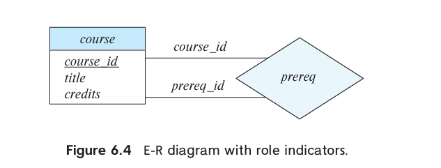

  * <b>Descriptive attributes example</b>
  grade is the descriptive attribute
  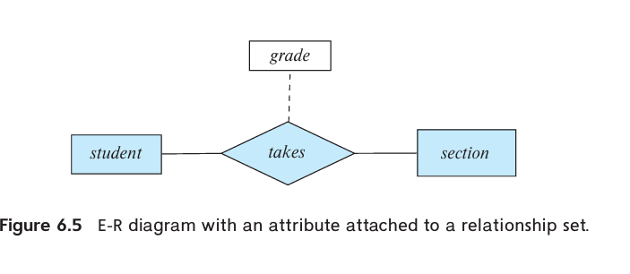

  * The number of entities involved in a relationship set is called the degree of relationship set
   - binary relationship set - degree 2
   - ternary relationship set - degree 3
  
  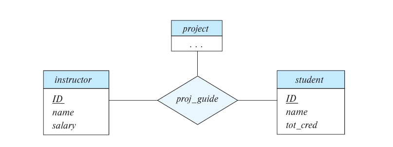

   
  * For each attribute, there is a set of permitted values, called the <b>domain</b>,or <b>value set</b>,of that attribute.

  * <b>Composite attributes</b> can be divided into subparts. Using composite attributes in a design schema is a good choice if a user will wish to refer to an entire attribute on some occasions, and to only a component of the attribute on other occasions. The address can be defined as the composite attribute address with the attributes street, city, state,and postal code.
  
  * <b>Multivalued attributes </b> - set of values like example of instructors phone number can either be 0 or one or more phone number.

  * <b>Derived attribute </b> The value for this type of attribute can be derived from the values of other related attributes or entities. exmaple age is a derived attribute computed from dob and current date.
   The value of a derived attribute is not stored but is computed when required.

  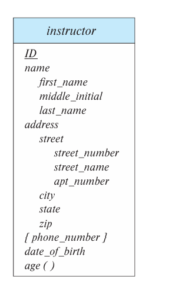
  - {phone_number} is a multivalued attribute enclosed in curly braces
  - age() is a derived attribute represent by paranthesis
  - adddress and name are a composite attributes represented in a hierarchy.

  #### Mapping Cardinalities
   Mapping cardinalities, or cardinality ratios, express the number of entities to which another entity can be associated via a relationship set.

   In a binary relationship, the mapping cardinalities must one of the following:
   1. <b>One-to-One</b> An entity in A is associated with at most one entity in B,and an entity in B is associated with at most one entity in A.
   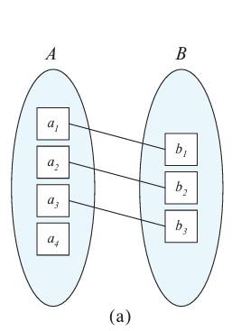

   2. <b>One-to-Many</b> An entity in A is associated with any number (zero or more) of entities in B. An entity in B, however, can be associated with atmost one entity in A.
   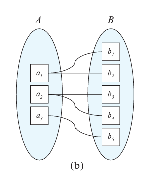

   3. <b>Many-to-One</b> An entity in A is associated with atmost one entity in B and an entity in B can be asscociated with any number of entities in A.
   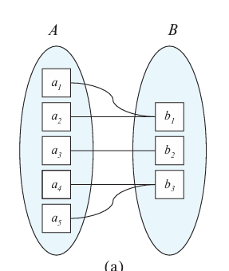

   4. <b>Many-to-Many</b> Anentity in A is associated with any number (zero or more) of entities in B,and an entity in B is associated with any number (zero or more) of entities in A.
   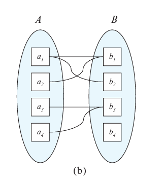

   ER diagram representations of the mapping cardinalities.
   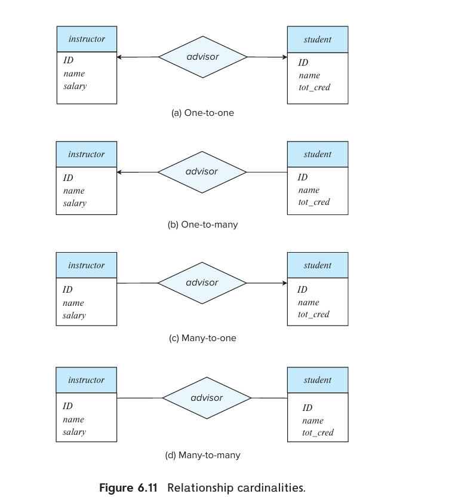

  * The participation of an entity set E in a relationship set R is said to be <b>total</b> if every entity in E must participate in at least one relationship in R.
  * It is possible that some entities in E do not participate in relationships in R, the participation of entity set E in relationship R is said to be <b>partial</b>.

  * We indicate total participation of an entity in a relationship set using double lines.

  * For example, a university may require every student to have at least one adviso.
  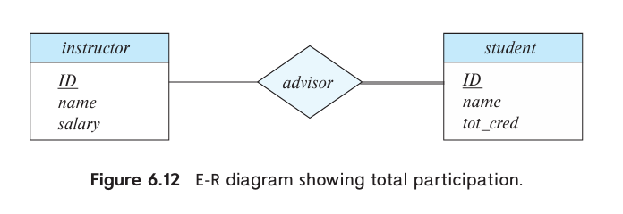

  * Complex participation can be represented in ER diagrams like l..h
    - l represents the minimum cardinality
    - h represents the maximum cardinality
  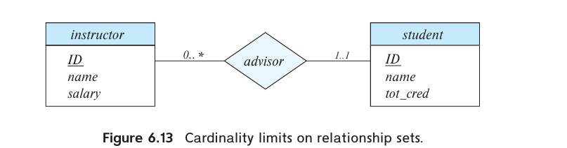
   
   A minimum value of 1 indicates total participation of the entity set in the relationship set; that is, each entity in the entity set occurs in at least one relationship in that relationship set. A maximum value of 1 indicates that the entity participates in at most one relationship, while a maximum value ∗ indicates no limit.

   <b>The relationship advisor is one-to-many from instructor to student,and further the participation of student in advisor is total, implying that a student must have an advisor. It is easy to misinterpret the 0.. ∗ on the left edge and think that the relationship advisor is many-to-one from instructor to student—this is exactly the reverse of the correct interpretation.</b>

   *  The <b>primary key for the relationship set</b> R is then the union of the primary keys of those participating entity sets E that do not have an incoming arrow from the relationship set R.

   * A <b>weak entity set</b> is one whose existence is dependent on another entity set, called its <b>identifying entity set</b>; instead of associating a primary key with a weak entity, we use the primary key of the identifying entity, along with extra attributes, called discriminator attributes to uniquely identify a weak entity. An entity set that is not a weak entity set is termed a strong entity set. The primary key of the weak entity set would consist of the union of the primary keys of the identifying entity sets, plus the discriminator of the weak entity set.

   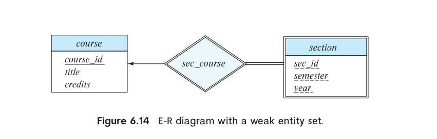
   - In E-R diagrams, a weak entity set is depicted via a double rectangle with the discriminator being underlined with a dashed line. The relationship set connecting the weak entity set to the identifying strong entity set is depicted by a double diamond.

   *  A good entity-relationship design does not contain redundant attributes. 


---

## 📉 Reduction to Relation Schema

**TODO:** Content to be added.

---

## 📘 Normalization Theory

The method for designing a relational database is to use a process commonly known as **normalization**.

1. **Determine if a relation schema is in "good form":**  
   There are several types of normal forms. To assess whether a relation schema is in a desirable form, we require extra information about the real-world system being modeled. The most common tool used is **functional dependencies**.

2. **Decompose if not in good form:**  
   If a relation schema is not in good form, it should be **decomposed** into multiple smaller schemas. Each of these should satisfy a suitable normal form.  
   > ⚠️ The decomposition must be **lossless**, meaning no information is lost in the process.

---

## 🧮 First Normal Form (1NF) Rules

To ensure that a database table is in **First Normal Form (1NF)**, it must satisfy the following conditions:

1. **Row order must not convey information**  
   Rows are inherently unordered. Their position should not imply any meaning.

2. **No mixing of data types within a column**  
   Each column should hold values of a single consistent data type.

3. **Primary key is mandatory**  
   Every table must have a **primary key** to uniquely identify each row.

4. **No repeating groups**  
   Each field must contain atomic (indivisible) values — no arrays or multi-valued columns.

### 📊 Example Table: `Student_Contact` (Before 1NF)

| Student_ID | Name      | Contact_Numbers       |
|------------|-----------|------------------------|
| S001       | Alice     | 12345, 67890           |
| S002       | Bob       | 11223                  |
| S003       | Charlie   | 33445, 55667, 77889    |

- **Violations**:
  - The `Contact_Numbers` field contains **multiple values** (non-atomic).
  - This table is **not in 1NF**.

### ✅ Converted Table: `Student_Contact` (In 1NF)

| Student_ID | Name    | Contact_Number |
|------------|---------|----------------|
| S001       | Alice   | 12345          |
| S001       | Alice   | 67890          |
| S002       | Bob     | 11223          |
| S003       | Charlie | 33445          |
| S003       | Charlie | 55667          |
| S003       | Charlie | 77889          |

- Now, each field contains only **atomic values**.
- The table satisfies **First Normal Form (1NF)**.

---

## 🧮 Second Normal Form (2NF) Rules

To achieve **Second Normal Form (2NF)**, a table must:

- First, be in **First Normal Form (1NF)** ✅
- Then, ensure that every non-key attribute is **fully functionally dependent on the entire primary key**.

### ✅ Rule:
Each non-key attribute must depend on the **entire composite primary key**, not just a part of it.


### 📊 Example Table: `Player_Inventory` (Before 2NF)

**Primary Key**: `{ Player_ID, Item_Type }`  
**Non-key Attributes**: `Item_Quantity`, `Player_Rating`

| Player_ID | Item_Type    | Item_Quantity | Player_Rating |
|-----------|--------------|---------------|----------------|
| jdog21    | amulets      | 2             | Intermediate   |
| jdog21    | rings        | 4             | Intermediate   |
| gila19    | copper coins | 18            | Beginner       |
| trev73    | shields      | 3             | Advanced       |
| trev73    | arrows       | 5             | Advanced       |
| trev73    | copper coins | 30            | Advanced       |
| trev73    | rings        | 7             | Advanced       |

### 🔍 Functional Dependencies

- `{ Player_ID, Item_Type } → Item_Quantity` ✅  
  (Depends on the entire composite key — satisfies 2NF)

- `{ Player_ID } → Player_Rating` ❌  
  (Depends on part of the key — violates 2NF)


### ❗ Issue

`Player_Rating` depends only on `Player_ID`, not on the full composite key `{ Player_ID, Item_Type }`.  
This violates 2NF and requires decomposition for proper normalization.

---

## 🧮 Third Normal Form (3NF) Rules

**Definition**:  
A relation is in **Third Normal Form (3NF)** if:

> Every non-key attribute depends on the key, the **whole** key, and **nothing but** the key.

This means it should:
1. Be in **Second Normal Form (2NF)**.
2. Have **no transitive dependencies**—non-key attributes must not depend on other non-key attributes.


#### ❌ Problem Example (Transitive Dependency)

**Table: `Player`**

| Player_ID | Player_Rating | Player_Skill_Level |
|-----------|----------------|---------------------|
| jdog21    | Intermediate   | 4                   |
| gila19    | Beginner       | 4                   |
| trev73    | Advanced       | 8                   |
| tina42    | Beginner       | 1                   |

- Functional Dependencies:
  - `Player_ID → Player_Skill_Level`
  - `Player_Skill_Level → Player_Rating`  
    (Transitive dependency: `Player_ID → Player_Rating` via `Player_Skill_Level`)

- ❗ **Issue**: `Player_Rating` is transitively dependent on the primary key `Player_ID`.

---

### ✅ 3NF Decomposition

To fix this, we separate the transitive dependency into a new table.

**Table 1: `Player`**

| Player_ID | Player_Skill_Level |
|-----------|---------------------|
| jdog21    | 4                   |
| gila19    | 4                   |
| trev73    | 8                   |
| tina42    | 1                   |

**Table 2: `Player_Skill_Levels`**

| Player_Skill_Level | Player_Rating |
|--------------------|----------------|
| 1                  | Beginner       |
| 2                  | Beginner       |
| 3                  | Beginner       |
| 4                  | Intermediate   |
| 5                  | Intermediate   |
| 6                  | Intermediate   |
| 7                  | Advanced       |
| 8                  | Advanced       |
| 9                  | Advanced       |

- Now all non-key attributes directly depend on the key only.
- This satisfies **3NF**.


### Boyce-Codd Normal Form (BCNF)

**Definition**:  
A relation is in **BCNF** if:

> Each attribute in the table must depend on the key, the **whole** key, and **nothing but** the key.

- It is a stricter version of 3NF.
- All BCNF relations are in 3NF, but not all 3NF relations are in BCNF.


🧠 **Key Difference**:
- 3NF allows non-superkey determinants if the dependent attribute is a **prime attribute** (part of some candidate key).
- BCNF requires **all** determinants to be superkeys—**no exceptions**.

## 🧮 Fourth Normal Form (4NF)

### 🔄 What is 4NF?

> A relation is in **Fourth Normal Form (4NF)** if it is in **Boyce-Codd Normal Form (BCNF)** and **has no multivalued dependencies (MVDs)**, except those where the **left side is a candidate key**.


### 💡 Understanding Multivalued Dependencies (MVDs)

A **Multivalued Dependency** means that:
- One attribute determines a **set of values** for another attribute
- That dependency is **independent** of other attributes in the table

**Notation:**  
- `{ A } →→ { B }` means: for each value of A, there are multiple independent values of B.


### 🎯 Problem Example: MVD in One Table

**Multivalued Dependencies Present:**
- `{ Model } →→ { Color }`
- `{ Model } →→ { Style }`

> This means each **Model** can have multiple **Colors** and multiple **Styles**, but **Colors and Styles are not related to each other**.


### 📦 Original Table: `Model_Colours_And_Styles_Available`

| Model   | Color  | Style       |
|---------|--------|-------------|
| Tweety  | Yellow | Bungalow    |
| Tweety  | Yellow | Duplex      |
| Tweety  | Blue   | Bungalow    |
| Tweety  | Blue   | Duplex      |
| Metro   | Brown  | High-Rise   |
| Metro   | Brown  | Modular     |
| Metro   | Grey   | High-Rise   |
| Metro   | Grey   | Modular     |
| Prairie | Brown  | Bungalow    |
| Prairie | Brown  | Schoolhouse |
| Prairie | Beige  | Bungalow    |
| Prairie | Beige  | Schoolhouse |
| Prairie | Green  | Bungalow    |

🧨 This design **repeats data unnecessarily**, leading to:
- **Redundancy**
- **Update anomalies**


## ✅ 4NF Solution: Decompose the Table

> We separate the **independent multivalued dependencies** into their own tables.

### 📗 Table 1: `Model_Colors_Available`

| Model   | Color  |
|---------|--------|
| Tweety  | Yellow |
| Tweety  | Blue   |
| Metro   | Brown  |
| Metro   | Grey   |
| Prairie | Brown  |
| Prairie | Beige  |
| Prairie | Green  |


### 📘 Table 2: `Model_Styles_Available`

| Model   | Style       |
|---------|-------------|
| Tweety  | Bungalow    |
| Tweety  | Duplex      |
| Metro   | High-Rise   |
| Metro   | Modular     |
| Prairie | Bungalow    |
| Prairie | Schoolhouse |


### ✅ Result: Tables Are Now in 4NF

- Each table contains **only one multivalued dependency**
- The **redundancy is removed**
- **No independent attributes are mixed together**

---

## 🧮 Fifth Normal Form (5NF)

### 🎯 Definition

> A relation is in **Fifth Normal Form (5NF)**, also called **Project-Join Normal Form (PJ/NF)**, **if it cannot be decomposed into any number of smaller tables without loss of data**, i.e., **without introducing spurious tuples** when joined back.

In simpler terms:  
> If a table can be reconstructed from multiple smaller tables using only **joins**, and there’s **no extra data** introduced in the process, it's in 5NF.


## 🧊 Scenario: Ice Cream Preferences

### 🧾 Original Table: `Preferred_Ice_Cream_Products_By_Person`

| Person | Brand     | Flavor               |
|--------|-----------|----------------------|
| Jason  | Frosty's  | Vanilla              |
| Jason  | Frosty's  | Chocolate            |
| Jason  | Alpine    | Vanilla              |
| Suzy   | Alpine    | Rum Raisin           |
| Suzy   | Ice Queen | Mint Chocolate Chip  |
| Suzy   | Ice Queen | Strawberry           |
| Suzy   | Frosty's  | Strawberry           |

### 🗣 Preferences (Natural Language)

#### Jason:
- Likes: **Vanilla**, **Chocolate**
- Brands: **Frosty's**, **Alpine**

#### Suzy:
- Likes: **Rum Raisin**, **Mint Chocolate Chip**, **Strawberry**
- Brands: **Alpine**, **Ice Queen**, **Frosty's**


## 🔀 Decomposed Tables (To Reach 5NF)

### 🟣 `Preferred_Brands_By_Person`

| Person | Brand     |
|--------|-----------|
| Jason  | Frosty's  |
| Jason  | Alpine    |
| Suzy   | Alpine    |
| Suzy   | Ice Queen |
| Suzy   | Frosty's  |


### 🔵 `Preferred_Flavors_By_Person`

| Person | Flavor              |
|--------|---------------------|
| Jason  | Vanilla             |
| Jason  | Chocolate           |
| Suzy   | Rum Raisin          |
| Suzy   | Mint Chocolate Chip |
| Suzy   | Strawberry          |


### 🟢 `Available_Flavors_By_Brand`

| Brand     | Flavor              |
|-----------|---------------------|
| Frosty's  | Vanilla             |
| Frosty's  | Strawberry          |
| Frosty's  | Mint Chocolate Chip |
| Alpine    | Vanilla             |
| Alpine    | Rum Raisin          |
| Ice Queen | Vanilla             |
| Ice Queen | Strawberry          |
| Ice Queen | Mint Chocolate Chip |


## ✅ Reconstruction with Joins

To reconstruct the original `Preferred_Ice_Cream_Products_By_Person`, we do:

```sql
SELECT
    pf.Person,
    pb.Brand,
    bf.Flavor
FROM Preferred_Brands_By_Person pb
JOIN Preferred_Flavors_By_Person pf ON pb.Person = pf.Person
JOIN Available_Flavors_By_Brand bf ON bf.Brand = pb.Brand AND bf.Flavor = pf.Flavor;
```

## ❓ Why Fifth Normal Form (5NF) Is Needed

The `Preferred_Ice_Cream_Products_By_Person` table combines **three different relationships**:

1. A person's preferred **brands**
2. A person's preferred **flavors**
3. The **flavors available** from each brand

These are **independent preferences**, but in the combined table, they appear as if they're directly related. This can lead to:

### ⚠️ Redundancy

If Jason likes "Vanilla" and "Chocolate", and he likes both "Frosty's" and "Alpine", and if both brands sell both flavors, we need **4 rows** to show all combinations.

Now imagine hundreds of people, brands, and flavors — the table grows **exponentially**.

---

### ⚠️ Update Anomalies

If a brand **stops offering** a flavor, you’d need to **manually remove every row** involving that flavor-brand combo — tedious and error-prone.

---

### ⚠️ Insertion Anomalies

You **can’t add** that someone likes "Mint Chocolate Chip" unless you know **which brand** offers it — even if that person hasn’t chosen a brand yet.

---

### ⚠️ Deletion Anomalies

If Suzy only likes "Strawberry" from "Frosty's" and we remove that row, we might lose the fact that she:
- Likes **Frosty's**
- Likes **Strawberry**

---

### ✅ Solution: Decompose into Independent Relations

By breaking it down into:
- `Preferred_Brands_By_Person`
- `Preferred_Flavors_By_Person`
- `Available_Flavors_By_Brand`

We isolate the **independent facts**, store them only once, and recombine them **losslessly** when needed using joins.

That’s the power of **5NF**: it ensures **no spurious data**, **minimal redundancy**, and **maximum integrity**.

---

### Database Engine
The functional components of the database can be broadly divided into 
storage manager, query processror and transation manager.
1. #### Storage Manager
    -  is the component of a database system that provides the interface between the low-level data stored in the database and the application programs and queries submitted to the system.
    - The storage manager is responsible for the interaction with the file manager.
    - The storage manager translates the various DML statements into low-level file-system commands. Thus, the storage manager is responsible for storing, retrieving, and updating data in the database.
    
    The storage component includes
    - ##### Authorization and Integrity manager 
        checks for the satisfaction of integrity constraints and authority of users to access the data.
    - ##### Transaction manager
        ensures that the database remains in consistent state despite of system failures and the concurrent transaction executions proceed without conflicts.
    - ##### File manager
        which manages the allocation of space on disk storage and the data structures used to represent information stored in the disk.
    - ##### Buffer manager
        responsible for fetching the data from disk storage into main memory
        and deciding what data to cache in main memory.
    
    The storage manager implements several data structures as part of physical system implementation:
    - ##### Data files
        which stores the database itself.
    - ##### Data dictionary
        which stores metadata about the structure of the database, in particular the schema of the database.
    - ##### Indicies
        which can provide fast access to data items.

2. #### Query Processor
    This component includes
    - ##### DDL interpreter
        interprets the DDL statements and records the output in the data dictionary.
    - ##### DML compiler
        translates the DML statements ina query language into an evaluvation plan consisting of low-level instructions that the query evaluvation engine understands.It also performs <i>query optimzation</i> by picking the lowest cost evaluvation plan from among the alternatives.
    - ##### Query evaluvation engine
        which executes the low level instructions generated by the DML compiler.

3. #### Transaction Manager
    * <b>transaction</b> is a collection of operations that performs a single logical function in a database application. 
    Each transaction is a unit of both atomicity and consistency.

    * <b>atomicity</b> - all or none requirement
    * <b>consistency</b> - correctness requirement
    * <b>durability</b> - persistence requirement

    This component consists of
    - ##### Recovery manager
        ensures the atomicity and durability properties of the database system itself.
        failure recovery
    - ##### Concurreny-control manager
        ensures the consistency of the database by controlling the interaction among the concurrent transactions.

### Database Engine Architecture
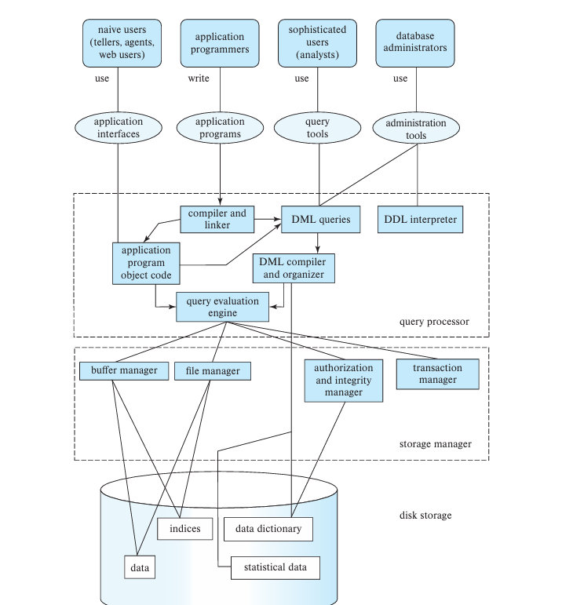

### Database Applications Architecture

 The business logic of the application, which says what actions to carry out under what conditions, is embedded in the application server, instead of being distributed across multiple clients. Three tier applications provide better security as well as better performance than two-tier applications.

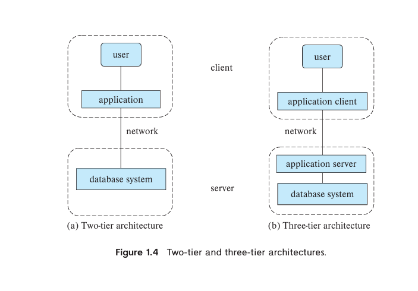

### Database users
* Naive users
* Application programmers
* Sophisticated users
* Database adminstrator (DBA)
    - Defines the  schemas and executes DDL 
    - Granting of authorization for data acess
    - Routine maintainance

> ## Why we are mainly focused on relational model?
>  The relational model remains the primary data model for commercial data-processing applications. It attained its primary position because of its simplicity, which eases the job of the programmer, compared to earlier data models such as the network model or the hierarchical model. It has retained this position by incorporating various new features and capabilities over its half-century of existence. Among those additions are object-relational features such as complex data types and stored procedures,support for XML data, and various tools to support semi-structured data.

## Relational Model
The relational model’s independence from any specific underlying low-level data structures has allowed it to persist despite the advent of newapproachestodatastorage, includingmoderncolumn stores that are designed for large-scale data mining.
### Relational Database
* A relational database consists of a collection of tables, each of which is assigned a unique name. 
* A row in a table represents a relationship among a set of values.
* A table is a collection of such relationships.

* In the relational model the term <b>relation</b> is used to refer to a <b>table</b>, while the term <b>tuple</b> is used to refer to a <b>row</b>. Similarly, the term <b>attribute</b> refers to a column of a <b>table</b>.

* Each attribute of the relation has a set of permitted values called the domain of the attribute. And the domains of all the attributes in a relation must be atomic.<b>A domain is atomic if all the elements of the domain are considered to be indivisible units</b>.
```
phone_number attribute of a employee relation is not atomic when
- a set of phone numbers are stored
- a phone number is splitted into country_code and number.

phone_number attribute is atomic when the phone number is stored as a single indvisible unit
```
<b> The important issue is not what the domain itself is,but rather howweusedomain
 elementsinourdatabase</b>

### Database schema
The logical design of a database
### Database instance
The snapshot of data in the database at a given instant in time.
### Keys
*  A key (whether primary, candidate, or super) is a property of the entire relation, rather than of the individual tuples. 
* No two tuples in a relation can have the same values for all the attributes.
* <b> super key </b> is a set of one or more attributes that, taken collectively , allows to uniquely identify a tuple in the relation. A superkey may contain extra (unnecessary) attributes beyond what is needed for uniqueness.
```
A superkey could be {ID}, {ID, Name}, {ID, Department}, etc
```

* <b>candidate key</b> is a minimal superkey—it uniquely identifies a row, but it does not contain any extraneous attributes.
```
Example Candidate Key: {ID}

Since ID alone is enough to uniquely identify an instructor, it is minimal.

Not a Candidate Key: {ID, Name}

This is a superkey, but it contains Name, which is not needed.
```

* <b>primary key</b> is a candidate key that is chosen by the database designer as the principal means of identifying tuples within a relation.
*  The primary key should be chosen such that its attribute values are never, or are very rarely changed.
    For instance, the address field of a person should not be part of the primary key, since it is likely to change. Social security numbers, on the other hand, are guaranteed never to change.

* <b>foreign key</b> is an attribute (or a set of attributes) in one table that references the primary key of another table. It is used to maintain referential integrity between related tables.
* <b>Foreign-key constraints</b> are a special case of referential integrity constraints, where the referenced attributes form the primary key of the referenced relation. 
* <b>Referential integrity constraint</b> requires that the values appearing in specified attributes of any tuple in the referencing relation also appear in specified attributes of at least one tuple in the referenced relation.

### Relational Algebra
 The relational algebra consists of a set of operations that take one or two relations as input and produce a new relation as their result.The relational algebra operations form the basis for the widely used SQL query language, database systems do not allow users to write queries in relational algebra.

#### Select operation
 σ sigma is used to denote this operation.
 ```
  σdept name=“Physics”∧ salary>90000 (instructor)

  σsalary>90000 (instructor)

 ```

#### Project operation
 Π pi is used to denote this operation.
 ```
  ΠID, name, salary(instructor)
 ```

 Composition of relational operations aka relational-algebra expressions
 ```
 Πname (σdeptname=“Physics” (instructor))
 ```

### Cartesian product operation
 × cross is used to denote this operation allows us to combine infor
mation from any two relations.
 ```
 r = instructor × teaches
 ```
  the Cartesian-product operation associates every tuple of instructor with every tuple of teaches.

### Join oprtation
 ⋈ is used to denote thie operation.
 we get only those tuples of instructor × teaches that pertain to instructors and the courses that they taught.
```
// Using select and product operator

 σinstructor.ID =teaches.ID(instructor × teaches)


 ⋈instructor.ID=teaches.ID

```
### Set Opertaions
#### Union
```
Πcourse id (σsemester =“Fall”∧year=2017 (section)) ∪
 Πcourse id (σsemester =“Spring”∧year=2018 (section))

```
#### Intersection
 The intersection operation, denoted by ∩, allows us to find tuples that are in both the input relations. 
```
 Πcourse id (σsemester =“Fall”∧year=2017 (section)) ∩
 Πcourse id (σsemester =“Spring”∧year=2018 (section))
```
#### Set-difference 
 The set-difference operation, denoted by −, allows us to find tuples that are in one relation but are not in another
```
 Πcourse id (σsemester =“Fall”∧year=2017 (section)) −
 Πcourse id (σsemester =“Spring”∧year=2018 (section))
```
#### Rename operation
ρ rho is used to denote this operation.
```
ρx (E)
```
 the result of expression E under the name x.

### Aggregate operations

### Outer Join


### Both the expression are equivalent:
```
 σdept name=“Physics”(instructor ⋈instructor.ID=teaches.ID teaches)
 

 (σdept name=“Physics”(instructor)) ⋈instructor.ID=teaches.ID teaches
```

### SQL
* IBM developed the first version of SQL called Sequel.
* SQL provides commands for
    - defining a relation schemas, deleting and modifing schemas.
    - specifying access rights to relations and views.
    - specifying integrity constranits on the data stored in the database.
    - defining views.
    - retreiving info from database , inserting, updating and deleting tuples in a relation.
    - specifying beginning and end points of transaction.
    

#### SQL DDL
offers ways for
- schema for each relation
- types of values associated with each attribute
- integrity constraints
- indicies maintained for each relation
- security and authorization information for each relation
- physical storage structure for each relation on disk

#### Basic types supported in SQL
* <b>char(n)</b> character - fixed length character string with user specified length "n"
If the string's length is less than n was stored in a attribute with type char(n), the string would be padded with spaces at the end.
If the string's length was greater than n was tried to be stored in a attribute with type char(n), error occurs in strict mode or the string will be truncated if not in strict mode.

* <b> varchar(n)</b> character varying - variable length character string with user specified maximum length "n".
- No space will  be padded to strings in this case , the exact string will stored.

* <b> int </b> integer 
* <b> smallint </b> small integer 
* <b> numeric(p,d) </b> fixed point number with user specified precision
    - number consisting of p digits and d of the p digits are to the right of the decimal point.
    - numeric(3,1) allows 44.5 to be stored exactly, but neither 444.5nor 0.32 can be stored exactly in a field of this type.

* <b> real, double precision </b> Floating point and Double precision
* <b> float(n)</b> floating point number with precision of atleast n digits
* <b> date </b>  A calendar date containing a (four-digit) year, month, and day of the month.
* <b> time </b> The time of day, in hours, minutes, and seconds.
* <b> timestamp </b> A combination of date and time.
```
 date '2018-04-25'
 time '09:30:00'
 timestamp '2018-04-25 10:29:01.45'
```

Each type may include a special value called the <b>null</b> value. A null value indicates an absent value that may exist but be unknown or that may not exist at all

how null values are output in a query result using the coalesce function.
```
select ID, coalesce(salary,0) as salary
 from instructor
```


##### CREATE
 SQL prevents any update to the database that violates an integrity constraint. For example, if a newly inserted or modified tuple in a relation has null values for any primary-key attribute.
 Similarly, an insertion of a course tuple with a dept name value that does not appear in the department relation would violate the foreign-key constraint on course, andSQL prevents such an insertion from taking place.
```
 CREATE TABLE department
            (dept_name varchar (20),
            building varchar (15),
            budget numeric (12,2),
            primary key (dept name),);

 CREATE TABLE course
            (course id varchar (7),
            title varchar(50),
            dept_name varchar(20),
            credits numeric(2,0),
            primary key (course id),
            foreign key (dept name) references department);
```
##### DROP
 The drop table command deletes all information about the dropped relation from the
 database.
```
 DROP TABLE department;
```
##### ALTER
 the alter table command to add and delete attributes to an existing relation.
```
 ALTER TABLE department ADD founder varchar(100);

 ALTER TABLE department DROP founder;
```

##### SELECT
The asterisk symbol “ * ” can be used in the select clause to denote “all attributes.” Thus, the use of instructor.* in the select clause of the query:

```
 select name, instructor.dept name, building
 from instructor, department
 where instructor.dept name= department.dept name;

 select instructor.*
 from instructor, teaches
 where instructor.ID= teaches.ID;
```
 
 The <b>as clause</b> is particularly useful in renaming relations. One reason to rename a relation is to replace a long relation name with a shortened version that is more convenient to use elsewhere in the query.
```
 select T.name, S.course id
 from instructor as T, teaches as S
 where T.ID= S.ID;
```

cartesian product on same relation
```
 select distinct T.name
 from instructor as T, instructor as S
 where T.salary > S.salary and S.dept name = 'Biology'
```
SQL also permits a variety of functions on character strings, such as concatenating (using “∥”), extracting substrings, finding the length of strings, converting strings to uppercase (using the function <b>upper(s)</b> wheres is a string) and lowercase (using the function <b>lower(s)</b>), removing spaces at the end of the string (using <b>trim(s)</b>),

Pattern matching can be performed on strings using the operator like.We describe patterns by using two special characters:
  - Percent (%): The % character matches any substring.
  - Underscore (_): The character matches any character.
  - 'Intro%' matches any string beginning with “Intro”.
  - '%Comp%' matches any string containing “Comp” as a substring, for example, 'Intro. to Computer Science', and 'Computational Biology'.
  - '___'matchesanystring of exactly three characters.
  - '___%'matchesanystring of at least three characters

SQL allows the specification of  backslash (∖) as the escape character
 - like 'ab∖%cd%' escape '∖' matches all strings beginning with “ab%cd”.
 - like 'ab∖∖cd%' escape '∖' matches all strings beginning with “ab∖cd”.

The <b>order by clause </b> causes the tuples in the result of a query to appear in sorted order. 
```
 select *
 from instructor
 order by salary desc, name asc;
```
SQL includes a <b>between</b> comparison operator to simplify where clauses that specify that a value be less than or equal to some value and greater than or equal to some other value. I
```
 select name
 from instructor
 where salary between 90000 and 100000;
 
 instead of:

 select name
 from instructor
 where salary <= 100000 and salary >= 90000;
```

##### Set Operations
 The SQL operations union, intersect,and except operate on relations and correspond to the mathematical set operations ∪, ∩,and−. We shall now construct queries involving the union, intersect,and except operations over two sets.
 ##### Union 
 To find the set of all courses taught either in Fall 2017 or in Spring 2018, or both, we write the following query.
 ```
            (select course id
            from section
            where semester = 'Fall' and year= 2017)
            union
            (select course id
            from section
            where 
            semester = 'Spring' and year= 2018);
 ```
 - The union operation automatically eliminates duplicates.
 - If we want to retain all duplicates, we must write union all in place of union:
 ```
            (select course id
            from section
            where semester = 'Fall' and year= 2017)
            union all
            (select course id
            from section
            where semester = 'Spring' and year= 2018)
 ```
##### Intersect
 To find the set of all courses taught in both the Fall 2017 and Spring 2018
 
 ```
            (select course id
            from section
            where semester = 'Fall' and year= 2017)
            intersect
            (select course id
            from section
            where semester = 'Spring' and year= 2018);
 ```
- If we want to retain all duplicates, we must write intersect all in place of intersect

##### Except 
 Tofindall courses taught in the Fall 2017 semester but not in the Spring 2018 semester,
 we write:
```
(select course id
 from section
 where semester = 'Fall' and year= 2017)
 except
 (select course id
 from section
 where semester = 'Spring' and year= 2018);
```
-  If we want to retain duplicates, we must write except all in place of except

##### Null values
Null values present special problems in relational operations, including arithmetic op erations, comparison operations, and set operations. The result of an arithmetic expression (involving, for example, +, −, ∗,or∕) is null if any of the input values is null. For example, if a query has an expression r.A+5, and r.A is null for a particular tuple, then the expression result must also be null for that tuple.

##### Aggregate functions
Aggregate functions are functions that take a collection (a set or multiset) of values as input and return a single value. SQL offers five standard built-in aggregate functions:
- Minimum
- Maximum
- Average
- Sum
- Count
```
 select avg (salary) as avg salary
 from instructor
 where dept name = 'Comp. Sci.'

  select count (*)
 from course
```

##### Group By
 Tuples with the same value on all attributes in the group by clause
 are placed in one group.

 Find the average salary in each department
 ```
  select dept name, avg (salary) as avg salary
 from instructor
 group by dept name
 ```
any attribute that is not present in the group by clause may appear in the select clause only as an argument to an aggregate function, otherwise the query is treated as erroneous.

##### Having clause

```
 select deptname, avg(salary) as avgsalary
 from instructor
 group by deptname
 having avg(salary)>42000;
```
aggregate functions treat nulls according to the following rule: All aggre gate functions except count (*) ignore null values in their input collection

##### Nested Subqueries
 - A subquery is a select-from-where expression that is nested within another query.

 - Intersection and set difference operation is not avilable in mysql. subqueries can be used instead.

##### Set Membership
 SQL allows testing tuples for membership in a relation. 
 The <b>in</b> connective tests for set membership, where the set is a collection of values produced by a select clause. The <b>not in</b> connective tests for the absence of set membership.
 
  we tested membership in a one-attribute relation
 ```
        // intersection alternative

        select distinct course id
        from section
        where semester = 'Fall' and year= 2017 and
        course id in (select course id
        from section
        where semester = 'Spring' and year= 2018);

        // except alternative

        select distinct course id
        from section
        where semester = 'Fall' and year= 2017 and
        course id not in (select course id
        from section
        where semester = 'Spring' and year= 2018);
 ```

  It is also possible to test for membership in an arbitrary relation in SQL.
  Some SQL implementations do not support the row construction syntax “(course id, sec id, semester, year)”

  find the total number of (distinct) students who have taken course
 sections taught by the instructor with ID 110011
  ```
        select count (distinct ID)
        from takes
        where (course id, sec id, semester, year) in (select course id, sec id, semester, year
        from teaches
        where teaches.ID= '10101');
  ```
##### Set Comparison
 the ability of a nested subquery to compare sets.

 Find the names of all instructors whose salary is greater than at least one instructor
 in the Biology department.
 ```
        select name
        from instructor
        where salary > some (select salary
                                from instructor
                                where dept name = 'Biology')
 ```
  SQL also allows < some, <= some, >= some, = some,and<> some comparisons.
  The keyword <b>any</b> is synonymous to <b>some</b> in SQL. Early versions of SQL allowed only any. Later versions added the alternative some to avoid the linguistic ambiguity of the word any in English.

 SQL also allows \<all, \<=all, \>=all, =all,and <>all comparisons.
Find the departments that have the highest average salary
```
        select dept name
        from instructor
        group by dept name
        having avg (salary) >= all (select avg (salary)
                                        from instructor
                                        group by dept name)
```
##### Testing for empty relations
 SQL includes a feature for testing whether a subquery has any tuples in its result. The
 exists construct returns the value true if the argument subquery is nonempty.

Find all courses taught in both the Fall 2017 semester and in the Spring 2018 semester
 ```
  select course id
 from section as S
 where semester = 'Fall' and year= 2017 and
 exists (select *
 from section as T
 where semester = 'Spring' and year= 2018 and
 S.course id= T.course id);
 ```
  The above query also illustrates a feature of SQL where a <b>correlation name</b> from an outer query (S in the above query), can be used in a subquery in the where clause. A subquery that uses a correlation name from an outer query is called a <b>correlated subquery</b>.

##### Test for the Absence of Duplicate Tuples
The unique construct returns the value true if the argument subquery contains no duplicate tuples.

Find all courses that were offered at most once in 2017
```
 select T.course id
 from course as T
 where unique (select R.course id
                from section as R
                where T.course id= R.course id and
                R.year = 2017)
```

### Subqueries in the from clause
MySQL and PostgreSQL, require that each subquery relation in the from clause must be given a name, even if the name is never referenced
```
select dept name, avg salary
 from (select dept name, avg (salary) as avg salary
 from instructor
 group by dept name)
 where avg salary > 42000;
```

###  The With Clause
 The with clause provides a way of defining a temporary relation whose definition is available only to the query in which the with clause occurs.

 ```
  // finds those departments with the maximum budget
     
     with max_budget (value) as
        (select max(budget)
        from department)
        select budget
        from department, max_budget
        where department.budget = max_budget.value;

//  find all departments where the total salary is greater than the average of the total salary at all departments

    with dept total (dept name, value) as
        (select dept name, sum(salary)
        from instructor
        group by dept name),
        dept total avg(value) as
        (select avg(value)
        from dept total)
        select dept name
        from dept total, dept total avg
        where dept total.value > dept total avg.value

 ```
##### Scalar Subqueries
 SQL allows subqueries to occur wherever an expression returning a value is permitted, provided the subquery returns only one tuple containing a single attribute; such sub queries are called scalar subqueries.
 Scalar subqueries can occur in select, where,and having clauses. 

##### Deletion
Delete command operates on only one relation. If we want to delete tuples from several relations, we must use one delete command for each relation
```
 delete from instructor;
```
##### Insertion
```
 insert into course
 values ('CS-437', 'Database Systems', 'Comp. Sci.', 4)
```

we might want to insert tuples on the basis of the result of a query.
```
 insert into instructor
 select ID, name, dept name, 18000
 from student
 where dept name = 'Music' and tot cred > 144;

```

##### Updates
```
 update instructor
 set salary = salary *1.05
 where salary < 70000;
```

##### Case construct
```
 update instructor
 set salary = case
                when salary <= 100000 then salary *1.05
                else salary *1.03
                end
```
##### Natural Join
 The natural join operation operates on two relations and produces a relation as the result. Unlike the Cartesian product of two relations, which concatenates each tuple of the first relation with every tuple of the second, natural join considers only those pairs of tuples with the same value on those attributes that appear in the schemas of both relations.
```
select name, course id
 from student natural join takes;


  select name, title
 from student natural join takes natural join course;
```

##### Join conditions
 The on condition allows a general predicate over the relations being joined. 
 ```
  select *
 from student join takes on student.ID = takes.ID;

 which is equivalent to

  select *
 from student, takes
 where student.ID = takes.ID;
 ```

  To distinguish normal joins from outer joins, normal joins are called inner joins in SQL

##### Outer Join
 The outer-join operation works in a manner similar to the join
 operations we have already studied, but it preserves those tuples that would be lost in
 a join by creating tuples in the result containing null values.
 1. <b>Left Outer Join</b>
    The left outer join preserves tuples only in the relation named before (to the left of) the left outer join operation
    ```
            select *
        from student natural left outer join takes
    ```
 2. <b>Right Outer Join</b>
    The right outer join preserves tuples only in the relation named after (to the right of) the right outer join operation.
    ```
                select *
            from takes natural right outer join student
    ```
 3. <b>Full Outer Join</b>
     The full outer join preserves tuples in both relations.
     full outer join is the union of a left outer join and the corresponding right outer join

### Views
 It is not always desirable for all users to see the entire set of relations in the database.
 SQL allows a “virtual relation” to be defined by a query, and the relation conceptually contains the result of the query. The virtual relation is not precomputed ands tored but instead is computed by executing the query whenever the virtual relation is used. 
 Whenever the view relation is accessed, its tuples are created by computing the query result. Thus, the view relation is created whenever needed, on demand.
  
       create view faculty as
                select ID, name, dept name
                from instructor;
   
### Materialized views
Certain database systems allow view relations to be stored, but they make sure that, if the actual relations used in the view definition change, the view is kept up-to-date. Such views are called materialized views.
The process of keeping the materialized view up-to-date is called <b> materialized view maintenance </b>
View maintenance can be done immediately when any of the relations on which the view is defined is updated. Some database systems, however, perform view maintenance lazily, when the view is accessed. Some systems update materialized views only periodically; in this case, the contents of the materialized view may be stale, that is, not up-to-date, when it is used, and it should not be used if the application needs up-to-date data. Andsomedatabase systems permit the database administrator to control which of the preceding methods is used for each materialized view.

an SQL view is said to be <b>updatable</b> (i.e., inserts, updates, or deletes can be applied on the view) if the following conditions are all satisfied by the query defining the view:
1. The from clause has only one database relation.
2. The select clause contains only attribute names of the relation and does not have any expressions,aggregates,or distinct specification.
3. Any attribute not listed in the select clause can be set to null; that is, it does not
 have a not null constraint and is not part of a primary key
4. The query does not have a group by or having clause

views can be defined with a with check option clause at the end of the view definition; then, if a tuple inserted into the view does not satisfy the view’s where clause condition, the insertion is rejected by the database system. Updates are similarly rejected if the new value does not satisfy the where clause conditions.

Different database systems specify different con ditions under which they permit updates on view relations; see the database system manuals for details.

### Trasactions
 A transaction consists of a sequence of query and/or update statements.

 The SQL standard specifies that a transaction begins implicitly when an SQL statement is executed. One of the following SQL statements must end the transaction.
 1. <b>Commit work</b> commits the current transaction; that is, it makes the updates per formed by the transaction become permanent in the database. After the transac tion is committed, a new transaction is automatically started.
 2. <b>Rolllback work</b> causes the current transaction to be rolled back; that is, it undoes all the updates performed by the SQL statements in the transaction. Thus, the database state is restored to what it was before the first statement of the transaction was executed.

  Once a transaction has executed commit work, its effects can no longer be undone by rollback work.

  The database system guarantees that in the event of some failure, such as an error in one of the SQL statements, a power outage, or a system crash, a transaction’s effects will be rolled back if it has not yet executed commit work. In the case of power outage or other system crash, the rollback occurs when the system restarts.

  By either committing the actions of a transaction after all its steps are completed, or rolling back all its actions in case the transaction could not complete all its actions successfully, the database provides an abstraction of a transaction as being atomic,that is, indivisible. Either all the effects of the transaction are reflected in the database or none are (after rollback). 

  In many SQL implementations, including MySQL and PostgreSQL, by default each SQL statement is taken to be a transaction on its own, and it gets committed as soon as it is executed.

  Such <b>automatic commit</b> of individual SQL statements must be turned off if a transaction consisting of multiple SQL statements needs to be executed. How to turn off automatic commit depends on the specific SQL implementation, although many databases support the command <b>set autocommit off</b>.
 
  SQL:1999 standard is to allow multiple SQL statements to been closed between the keywords begin atomic… end.All the statements between the keywords then form a single transaction, which is committed by default if execution reaches the end statement. Only some databases, such as SQLServer, support the above syntax. However, several other databases, such as MySQL and PostgreSQL, support a begin statement which starts a transaction containing all subsequent SQL statements, but do not support the end statement; instead, the transaction must be ended by either a commit work or a rollback work command.

### Integrity Constraints
Integrity constraints ensure that changes made to the database by authorized users do not result in a loss of data consistency. Thus, integrity constraints guard against accidental damage to the database.

 Examples of integrity constraints are:
  - An instructor name cannot be null.
  - No two instructors can have the same instructor ID.
  - Every department name in the course relation must have a matching department name in the department relation.
  - Thebudget of a department must be greater than $0.00
  
 an integrity constraint can be an arbitrary predicate pertaining to the database. 

  Integrity constraints are usually identified as part of the database schema design process and declared as part of the create table command used to create relations. However, integrity constraints can also be added to an existing relation by using the command alter table table-name add constraint,whereconstraint can be any constraint on the relation. When such a commandis executed, the system first ensures that the re lation satisfies the specified constraint. If it does, the constraint is added to the relation; if not, the command is rejected.

#### Constraints on Single relation
- <b>primary key constraints</b>
- <b>not null</b>
    *  The not null constraint prohibits the insertion of a null value for the attribute, and is an example of a domain constraint.
    ```
       name varchar(20) not null
       budget numeric(12,2) not null
    ```
- <b>unique</b>
- <b>check(\<predicate\>)</b>
    * A common use of the check clause is to ensure that attribute values satisfy specified conditions, in effect creating a powerful type system. 

    ``` 
        create table section
                    (course idvarchar (8),
                    sec id varchar (8),
                    semester   varchar (6),
                    year numeric (4,0),
                    building varchar (15)
                    room number varchar (7),
                    time slot id varchar (4),
                    primary key (course id, sec id, semester, year),
                    check (semester in ('Fall', 'Winter', 'Spring', 'Summer')));

         create table department
                    (dept_name varchar (20),
                    building varchar (15),
                    budget numeric (12,2) check (budget >0),
                    primary key (dept name));

    ```
    The predicate in the check clause can, according to the SQL standard, be an ar bitrary predicate that can include a subquery. However, currently none of the widely used database products allows the predicate to contain a subquery.
#### Referential Integrity
 Often, we wish to ensure that a value that appears in one relation (the referencing rela tion) for a given set of attributes also appears for a certain set of attributes in another relation (the referenced relation).
 ```
       create table instructor
                    (ID varchar (5),
                    name varchar (20) not null,
                    dept_ame varchar (20),
                    salary numeric (8,2) check (salary > 29000),
                    primary key (ID),
                    foreign key (dept name) references department);
 ```
  The list of attributes must, however, be declared as a superkey of the referenced relation, using either a primary key constraint or a unique constraint The specified list of attributes must, however, be declared as a superkey of the referenced relation, using either a primary key constraint or a unique constraint.

  SQL also supports a version of the references clause where a list of at tributes of the referenced relation can be specified explicitly
  ```
   foreign key (dept name) references department(dept name)
  ```

   When a referential-integrity constraint is violated, the normal procedure is to reject the action that caused the violation (i.e., the transaction performing the update action is rolled back).
   However, a foreign key clause can specify that if a delete or update action on the referenced relation violates the constraint.
   ```
    foreign key (dept_name) references department
                                        on delete cascade
                                        on update cascade
   ```
   <b> on delete cascade </b> - Deleting the tuple refering the deleted record of department relation.
   <b> on update cascade </b> - the system does not reject an update to a field referenced by the constraint if it violates the constraint; instead, the system updates the field dept name in the referencing tuples in course to the new value as well.
   <b> set null</b> - when the constraint is violated, the refrenced attributes is set to null
   <b> set default </b> -  when the constraint is violated, the refrence attributed is set to default value of the domain.
   
   If a cascading update or delete causes a constraint violation that cannot be handled by a further cascading operation, the system aborts the transaction. As a result, all the changes caused by the transaction and its cascading actions are undone.

   <b>Attributes of foreign keys are allowed to be null</b>, provided that they have not otherwise been declared to be not null. 

#### Assigning name to constraints
```
 salary numeric(8,2), constraint minsalary check (salary > 29000)

  alter table instructor drop constraint minsalary
```

 the SQL standard allows a clause initially deferred to be added to a constraint specification; the constraint would then be checked at the end of a transaction and not at intermediate steps.
 The default behavior is to check constraints immediately, and many database implementations do not support deferred constraint checking.

#### Create Table Extension
 Applications often require the creation of tables that have the same schema as an ex isting table. 
```
 create table temp_instructor like instructor
```

### Index
An index on an attribute of a relation is a data structure that allows the database system to find those tuples in the relation that have a specified value for that attribute efficiently, without scanning through all the tuples of the relation.
```
 create index dept_index on instructor (dept name);
```
When a user submits an SQL query that can benefit from using an index, the SQL query processor automatically uses the index. 
```
 drop index <index-name>;
```

### Authorization
We may assign a user several forms of authorizations on parts of the database. Autho rizations on data include:
1. Authorization to read data
2. Authorization to insert data
3. Authorization to delete data
4. Authorization to update data
 Each of these types of authorizations is called a <b>privilege</b>.

  It is worth noting that the SQL authorization mechanism grants privileges on an entire relation, or on specified attributes of a relation. However, it does not permit authorizations on specific tuples of a relation.

 #### Granting privileges
 A user who creates a new relation is given all privileges on that relation automatically.
 ```
 grant select on department to Amit, Satoshi;

grant update (budget) on department to Amit, Satoshi; // If the attribute is not specified. 
                                                    // update privileges will be granted on all attibutes of the
                                                    // relation

 ```

  The user name <b>public</b> refers to all current and future users of the system. Thus, privileges granted to public are implicitly granted to all current and future users.

 #### Revoking privileges
 ```
  revoke select on department from Amit, Satoshi;

 revoke update (budget) on department from Amit, Satoshi;
 ```

 #### Roles
  Roles enable us to assign a set of privileges to a user according to the role that the user plays in the organization.
 ```
 create role instructor;

  grant select on takes
 to instructor;

  create role dean;
 grant instructor to dean;
 grant dean to Satoshi;

 ```

 #### Authorization on views
 A user who creates a view does not necessarily receive all privileges on that view. Users receives only those privileges that provide no additional authorization beyond those that the user already had.
 A user who creates a view cannot be given update authorization on a view without having update authorization on the relations used to define the view. If a user creates a view on which no authorization can be granted, the system will deny the view creation request. 

 #### Authorization on schemas
 The SQL standard specifies a primitive authorization mechanism for the database schema:
  Only the owner of the schema can carry out any modification to the schema, such as creating or deleting relations, adding or dropping attributes of relations, and adding or dropping indices.

   SQL includes a <b>references privilege</b> that permits a user to declare foreign keys when creating relations. The SQL references privilege is granted on specific at tributes in a manner like that for the update privilege. 

   ```
    grant references (dept name) on department to Mariano;
   ```
 #### Transfer of privileges
  A user who has been granted some form of authorization may be allowed to pass on this authorization to other users.
  ```
  grant select on department to Amit with grant option
  ```
 #### Revocation of privileges
  <b>cascading revocation</b> revocation of a privilege from a user/role may cause other users/roles also to lose that privilege

  use restrict to prevent casacading revocation
  ```
   revoke select on department from Amit, Satoshi restrict;
  ```
 #### Row level Authorization
  database systems provide mechanisms for fine-grained authorization at the level of specific tuples within a relation.

#### Approaches for accessing from general purpose programming langauges
 ### Dynamic SQL
 A general-purpose program can connect to and communicate with a database server using a collection of functions (for procedural languages) or methods (for object-oriented languages). Dynamic SQL allows the program to construct an SQL query as a character string at runtime, submit the query, and then retrieve the result into program variables a tuple at a time.

 ### JDBC
 ```

     public static void JDBCexample(String userid, String passwd)
     {
            try(Connection conn = DriverManager.
            getConnection( "jdbc:oracle:thin:@db.yale.edu:1521:univdb",userid, passwd);
            Statement st = conn.createStatment();
            ){

                try {
                    stmt.executeUpdate(
                    "insert into instructor values(’77987’,’Kim’,’Physics’,98000)");
                    }
                    catch (SQLException sqle) {
                    System.out.println("Could not insert tuple. " + sqle);
                    }
                
                ResultSet rset = stmt.executeQuery(
                                        "select dept name, avg (salary) "+
                                        " from instructor "+
                                        " group by dept name");
                while (rset.next()) {
                System.out.println(rset.getString("dept name")+""+rset.getFloat(2));
                }
                    
            }catch(Exception e)
            {
                System.out.println("Exception : " + sqle)
            }
     }
 ```
 #### Prepared statements
 ```
  PreparedStatement pStmt = conn.prepareStatement(
                    "insert into instructor values(?,?,?,?)");
    pStmt.setString(1, "88877");
    pStmt.setString(2, "Perry");
    pStmt.setString(3, "Finance");
    pStmt.setInt(4, 125000);
    pStmt.executeUpdate();
    pStmt.setString(1, "88878");
    pStmt.executeUpdate();
 ```
 A technique called <b>SQL injection</b> can be used bymalicioushackersto steal data or damage the database.
  Use of a prepared statement would prevent this problem because the input string would have escape characters inserted, so the resulting query becomes harmless and returns the empty relation.

  Programmers must pass user-input strings to the database only through parameters of prepared statements; creating SQL queries by concatenating strings with user-input values is an extremely serious security risk and should never be done in any program.

   Some database systems allow multiple SQL statements to be executed in a single JDBC execute method, with statements separated by a semicolon. This feature has been turned off by default on some JDBC drivers because it allows malicious hackers to insert whole SQL statements using SQL injection. 

 ### Embedded SQL
 the SQL statements are identified at compile time using a preprocessor, which
 translates requests expressed in embedded SQL into function calls. At runtime,
 these function calls connect to the database using an API that provides dynamic SQL facilities but may be specific to the database that is being used.

### Functions and Procedures
 Procedures and functions allow “business logic” to be stored in the database and executed from SQL statements.
 While business logic can be encoded as programming-language procedures stored entirely outside the database, defining them as stored procedures in the database has several advantages. multiple applications to access the procedures, and it allows a single point of change in case the business rules change, without changing other parts of the application. Appli cation code can then call the stored procedures instead of directly updating database relations.
 ```
     create function dept count(dept name varchar(20)) returns integer
        begin
        declare d_count integer;
            select count(*) into d_count
            from instructor
            where instructor.dept_name= dept_name
        return d count;
        end

    //  The SQL standard supports functions that can return tables as results;
    //  such functions are called table functions

    create function instructor of (dept name varchar(20))
        returns table (
                        ID varchar (5),
                        name varchar (20),
                        dept name varchar (20),
                        salary numeric (8,2)
                        )
    return table(select ID, name, dept name, salary
                from instructor
                where instructor.dept name = instructor_of.dept name);

   // function call
    select * from table(instructor_of ('Finance'))
 ```
 the procedural languages supported by Oracle (PL/SQL), Microsoft SQL Server (TransactSQL), and PostgreSQL (PL/pgSQL) all differ from the standard syntax we present here.

 ### Procedures
 ```
        create procedure dept_count_proc(in dept_name varchar(20),out d_count integer)
                begin
                    select count(*) into d_count
                    from instructor
                    where instructor.dept_name= dept_count_proc.dept_name
                end

 ```
  The keywords in and out indicate, respectively, parameters that are expected to have values assigned to them and parameters whose values are set in the procedure in order to return results.
   SQL permits more than one procedure of the same name, so long as the number of arguments of the procedures with the same name is different.

 ### Triggers
 A trigger is a statement that the system executes automatically as a side effect of a modification to the database. 
  Triggers can be used to implement certain integrity constraints that cannot be specified using the constraint mechanism of SQL. Triggers are also useful mechanisms for alerting humans or for starting certain tasks automatically when certain conditions are met. 

  Using triggers to maintain referential integrity
```
 create trigger timeslot check1 after insert on section
 referencing new row as nrow
 for each row
    when (nrow.time slot id not in (select time slot id from time_slot)) 
 begin
  rollback
 end;
 
 
 create trigger timeslot check2 after delete on timeslot
 referencing old row as orow
 for each row
    when (orow.time slot id not in ( select time slot id from time_slot) 
    and orow.time slot id in (select time slot id from section)) 
 begin
  rollback
 end;
```
 The when statement specifies a condition. The system executes the rest of the trigger body only for tuples that satisfy the condition.  In our example, though, thereis only one statement, which rollsback the transaction that caused the trigger to get executed. 

### Advanced Aggregation features
#### Ranking
```
    select ID, rank() over (order by (GPA) desc) as s_rank
    from student_grades;
```
 Ranking can be done within partitions of the data.
 ```
    select ID, dept_name,
    rank () over (partition by dept_name order by GPA desc) as dept_rank
    from dept_grades
    order by dept_name, dept_rank;
 ```
 <b>partition</b> allows to group by one or more attribute of a relation and still getting all the tuples from the relation.
